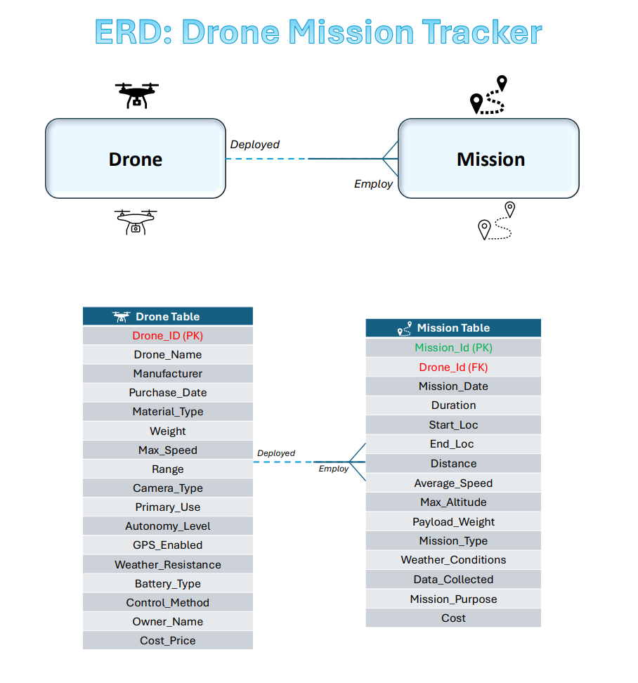
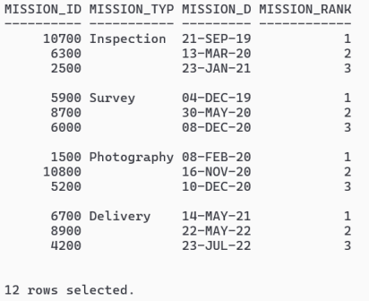
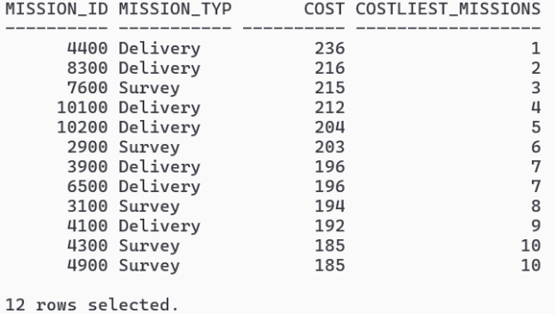
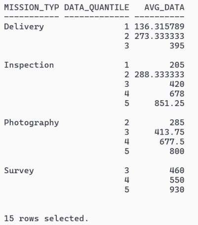
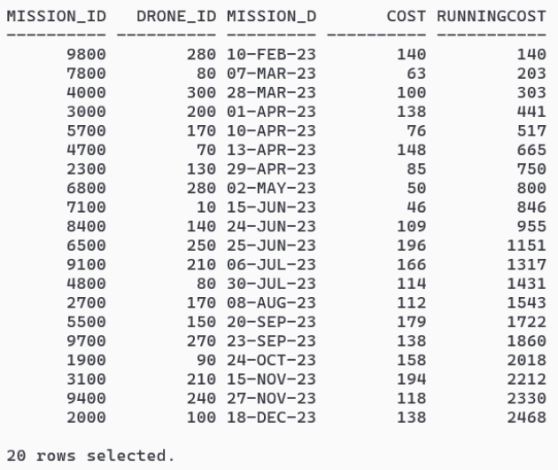
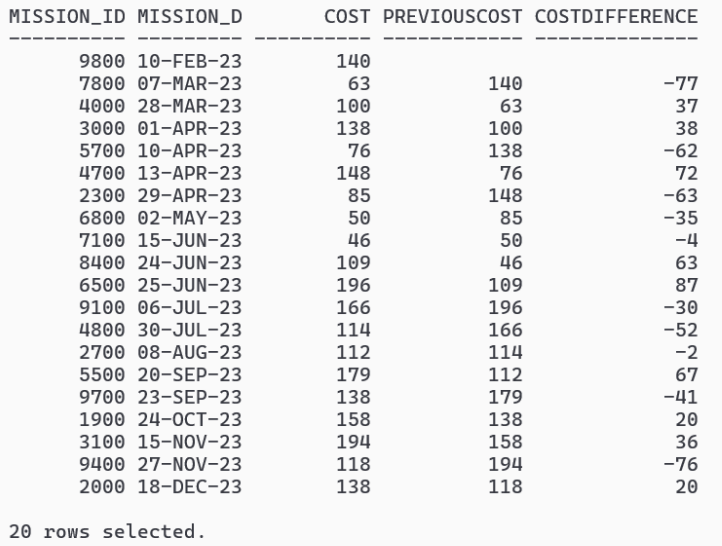
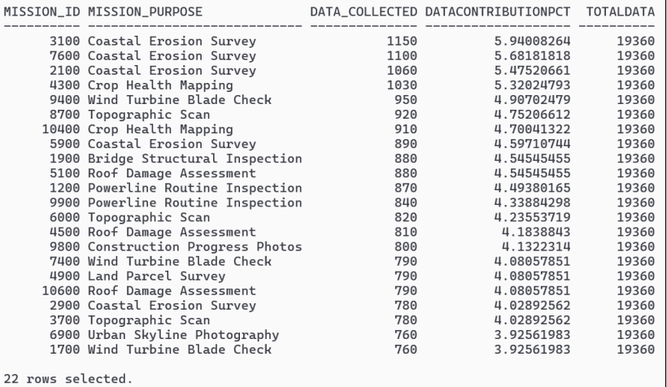
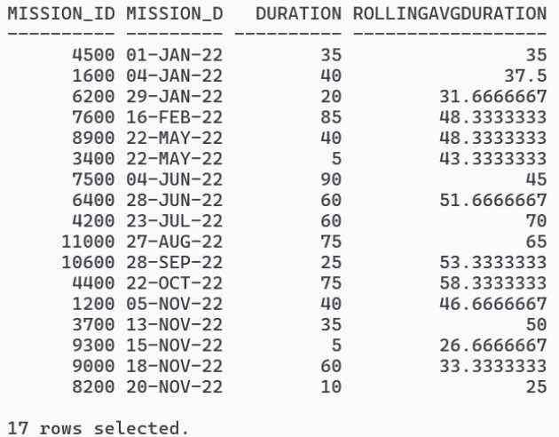
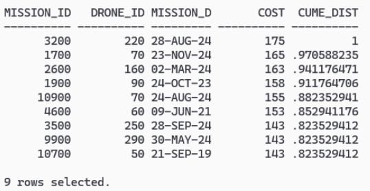
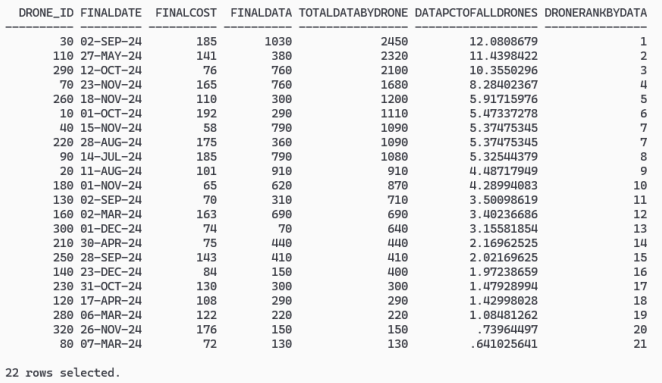

# Oracle SQL Drone Mission Analysis

This repository contains an Oracle SQL project based on a Drone Mission Tracker database. It demonstrates table creation, sample data loading, and analytical SQL queries using Oracle window functions.

## Project Background

This project was originally completed as part of an MSc class assignment on relational databases and SQL analytic functions. The project scope involved building a relational database for drones and their missions, where one drone can complete many missions and each mission is fulfilled by a single drone.

## Database Structure

The project contains two main tables:

### 1. Drone
Stores drone-level information such as:
- drone ID
- drone name
- manufacturer
- purchase date
- material type
- max speed
- range
- camera type
- primary use
- autonomy level
- GPS availability
- battery type
- owner name
- cost price

### 2. Mission
Stores mission-level information such as:
- mission ID
- drone ID
- mission date
- duration
- start and end location
- distance
- average speed
- max altitude
- payload weight
- mission type
- weather conditions
- data collected
- mission purpose
- mission cost

## Files in this Repository

- **DMT.sql**  
  Contains the Oracle SQL schema creation statements, constraints, inserts, and commit statements for the Drone and Mission tables.

- **analytical_queries.sql**  
  Contains analytical SQL queries written on the Drone and Mission tables using Oracle analytic functions.

## SQL Skills Demonstrated

This project demonstrates:

- Oracle SQL
- DDL and DML
- primary key and foreign key relationships
- filtering and sorting
- analytical / window functions
- ranking functions:
  - `RANK()`
  - `DENSE_RANK()`
  - `ROW_NUMBER()`
- distribution functions:
  - `NTILE()`
  - `PERCENT_RANK()`
  - `CUME_DIST()`
  - `RATIO_TO_REPORT()`
- navigation functions:
  - `LAG()`
  - `LEAD()`
  - `FIRST_VALUE()`
  - `LAST_VALUE()`
  - `NTH_VALUE()`
- rolling totals and rolling averages
- mission-level cost, distance, and data analysis
- joins between relational tables

## Example Analyses Included

Some of the analyses in this project include:

- ranking the earliest missions within each mission type
- identifying the top costliest missions
- splitting data collected into quantiles
- calculating cumulative mission cost
- comparing current missions with previous and next missions
- detecting time gaps between missions
- calculating rolling averages and rolling totals
- measuring range utilisation against drone capacity
- evaluating data collected per kilometre
- ranking drones by mission data contribution

## Why This Project Matters

I added this project to my portfolio to demonstrate practical SQL skills beyond basic querying. It shows how Oracle analytical functions can be used to explore operational data and answer business-style analytical questions.

## Tool Used

- Oracle SQL

## Sample Query Outputs

### ERD: Drone Mission Tracker

### Rank the earliest missions under each mission type

### Show the top 10 most expensive missions

### Divide data collected into 5 quantiles by mission type

### Show cumulative mission cost for 2023

### Show the cost difference compared to the previous mission

### Show percentage contribution to total data collected

### Show rolling average duration for missions in 2022

### Analyse how efficiently each mission uses the drone's range

### Rank drones by total data collected from 2024 onwards

## Note

This project was originally completed as part of a class assignment and has been organised here in a cleaner format for portfolio purposes.
